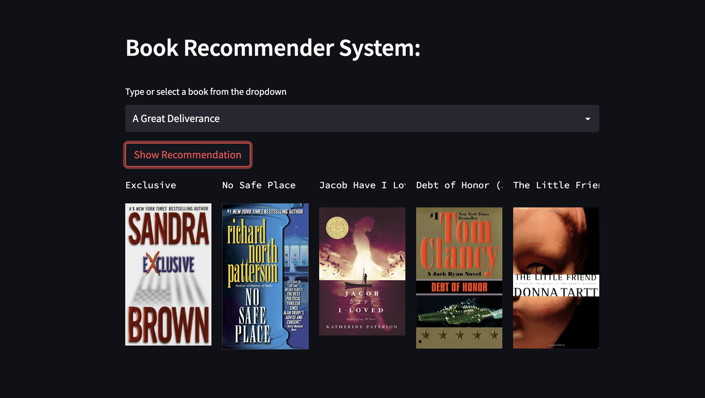
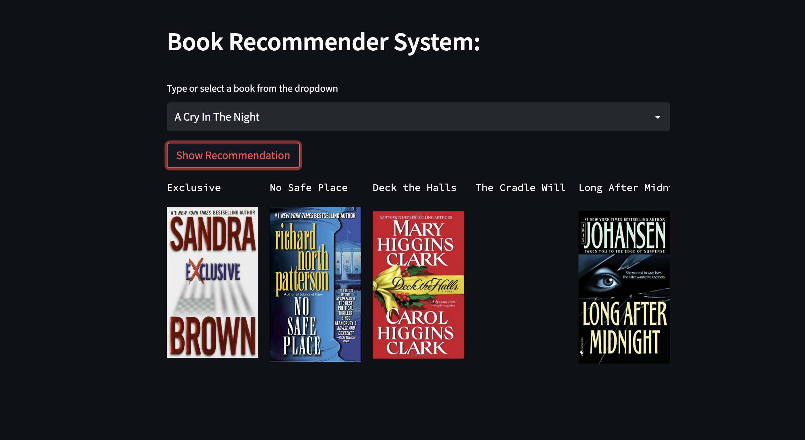

# Recommendation Engine
Build a book recommendation system using the the machine learning algorithms and deployment in the Heroku platfom

In today's very busy society, recommendation systems are gaining in importance. People are often pressed for time due to the many duties they must do in a day. The importance of recommendation systems arises from the fact that they enable users to make intelligent decisions without using mental effort.

A recommendation system's primary objective is to locate material that would be of interest to a person. In addition, it requires a number of variables in order to provide personalized lists of helpful and entertaining material for each user/person. Recommendation systems are Artificial Intelligence-based algorithms that sift through all potential possibilities and provide a personalized list of things that are interesting and pertinent to a certain user. These results are based on the user's profile, search/browsing history, what other people with similar characteristics/demographics are viewing, and the likelihood that you will watch the same movies. Using the existing data, this is performed using predictive modeling and heuristics.

# Project Objective:

This is a cloud-based online application that may propose different types of comparable books depending on a user's preferences. After evaluating the project, the example demo is shown below.

# Example Demo:
[Heroku App](https://book-recommendation3.herokuapp.com/)
[](Book_1.png)
[](Book_2.png)
[](Book_3.png)

# Project Steps:

1. Loading dataset
2. Exploratory Data Analysis (EDA)
3. Feature Engineering
4. Feature Selection
5. Train the Model
6. Model Selection
7. Saving model in artifacts folder
8. Create Conda Environment
```
conda create --prefix ./env python==3.7 -y #name of conda: ./env
conda activate ./env/
```
9. Create the setup file
```
touch setup.py
```
10. Create README file
```
touch README.md
```
11. Create requirements txt file
```
touch requirements.txt
```
12. Create src folder
```
mkdir src
```
13. create init file inside the src folder
```
touch src/__init__.py
```
14. install requirements
```
pip install -r requirements.txt
```
15. create app file
```
touch app.py
```
16. Develop web application
```
st.header("Book Recommender System using MAchine Learning")
```
17. Local system execution of web application
```
streamlit run app.py
```
18. Select the book name by selectbox of streamlit
19. define button for recommendation
20. define gitignore
21. develop in cloud platform like Heroku
```
touch Procfile
```
22. create setup sh file
```
touch setup.sh
```
23. open the Heroku: 
